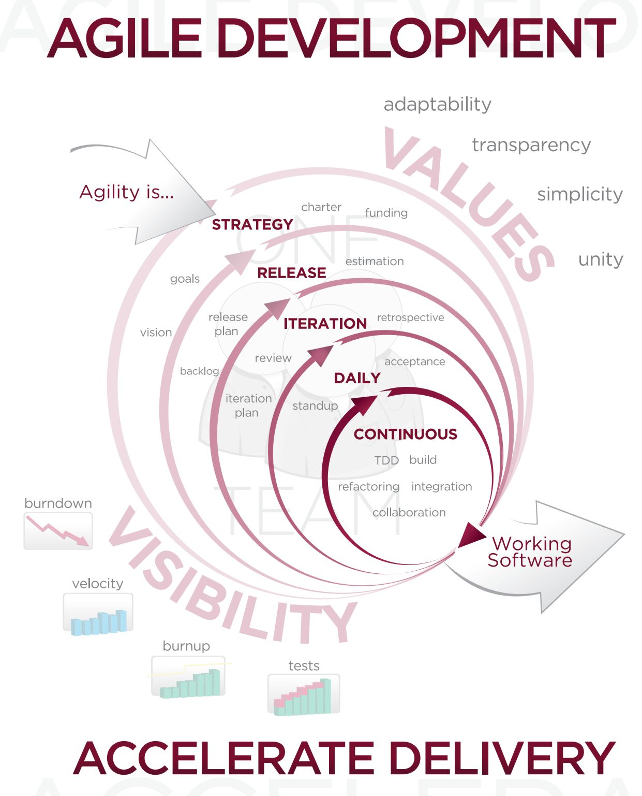

# Agile Software Development #

----

# Agile Manifesto #

> We are uncovering better ways of developing software by doing it and helping others do it. Through this work we have come to value: 
>
> **Individuals and interactions** over processes and tools 
> **Working software** over comprehensive documentation 
> **Customer collaboration** over contract negotiation 
> **Responding to change** over following a plan 
>
> That is, while there is value in the items on the right, we value the items on the left more. 

----

# Agile Methodology #

 - Accept changing requirements
 - Multi-disciplinary teams
 - Iterative & incremental development
 - Time-boxed delivery (weeks, not months)
 - Deliver working software quickly
 - Co-location & face-to-face communication

----

# An Agile Team #

 - Cross-functional
 - Self-organizing
 - Small: 5-10 members
 - Face-to-face communication
    - Typically includes a daily standup
 - Customer representative

----

# Specific Tools #

 - Continuous integration
 - Test-driven development

----

# Does it work? #

 - The body of literature leaves much to be desired
    - Methodology may be suspect (LoC is probably not the best measure of work completed, or quality)
    - XP is best-studied
 - 4 categories of studies (Tore Dybå & Torgeir Dingsøyr, IEEE Software, September/October 2009)

----

# Introduction & Adoption #

 - Agile methods are easy to adopt
    - XP is more difficult to introduce in large organizations
 - Agile users report benefits
 - May detract attention from architectural/design issues

----

# Human & Social Factors #

 - XP thrived in a wide range of organization types
 - Promotes team awareness
 - Healthy group psychology is needed

----

# Perceptions #

 - Customers reported high satisfaction
    - Customer representative is a high-stress role - unsustainable
 - Developers report satisfaction with their job, the product
 - Pair programming reported to be exhausting due to attention requirements
 - University students believe Agile methods are an opportunity for training for future work
    - Pair programming doesn't work well when the pair has disparate skill levels
    - Test-driven development is difficult

----

# Comparative studies #

 - Integrate changes more quickly
 - Demonstrate business value quickly
 - Agile team members are less interchangeable
 - Studies of productivity
    - Developers report increased productivity
    - Objective measures lack sufficient controls for validity

----

# Future study #

 - Decentralized teams
 - Large teams
 - Critical software (pacemakers, aerospace...)
 - Teams that didn't *choose* Agile
 - Young/old teams (teamwork)
 - Young/old programmers (skill level)
 - **Human & social factors**

----

## Team dynamics ##

 - Kieran Conboy & Sharon Coyle, IEEE Software, July/August 2011
    - Developer fear of skill-deficiency exposure
    - Broader skill-sets for developers
    - Increased social interaction
    - Lack of business knowledge
    - Understanding of Agile values & principles
    - Lack of motivation
    - Devolved decision-making
    - Implementing Agile-compliant performance evaluation
    - Recruiting challenges

----

# Bottom line #

 - Like most methodologies, Agile has a place
 - The happy medium may be project-specific and/or team-specific
    - Good teams probably work well regardless of methodology
    - Out-of-control projects probably fail regardless of methodology
 - Compare project & team requirements with the characteristics Agile offers
 - Mix-n-match with other approaches

## There is no panacea; Try It And See™! ##

